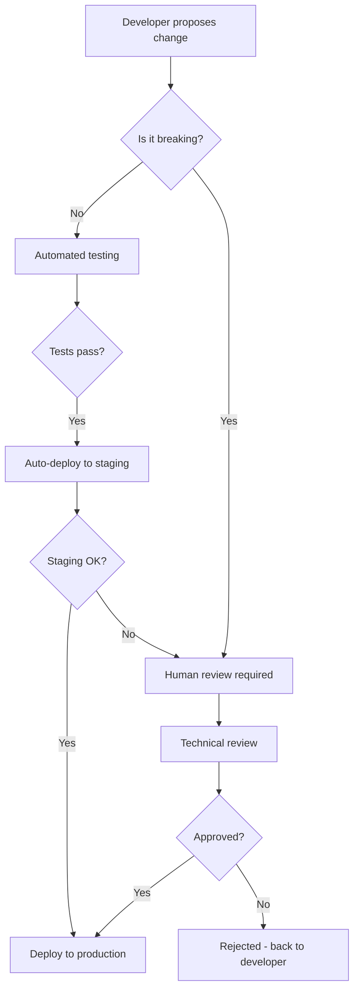

# Aurora AI Empire - Automated Maintenance Framework

## 🎯 **Mission Statement**

**"Maintain operational excellence through automation, synchronization, and proactive governance across all Aurora environments."**

## 🚀 **Solo Developer Mode**

**Perfect for when you're flying solo!** This framework is designed to work whether you have a team or not. Here's how it adapts for solo development:

### **Simplified Workflow**

- **You make all decisions** - No team approvals needed
- **Automation handles the boring stuff** - Health checks, backups, monitoring
- **You get notified** - But only when you need to make a decision
- **Everything stays in sync** - Your 3 environments work together seamlessly

### **Your Daily Involvement (Optional)**

- **2 minutes/day**: Quick glance at automated daily summary (7:00 AM email)
- **5 minutes/week**: Weekly performance review (Monday morning)
- **10 minutes/month**: Monthly strategic planning (1st of month)
- **As needed**: Emergency alerts come through immediately

### **Automation Does The Rest**

- ✅ **Health monitoring** across all environments
- ✅ **Automated backups** and disaster recovery
- ✅ **Security updates** and vulnerability scanning
- ✅ **Performance optimization** and database maintenance
- ✅ **Cross-environment synchronization**

## 🏗️ **Framework Overview**

This framework ensures:

- ✅ **Automated maintenance** - Systems maintain themselves
- ✅ **Multi-environment sync** - Vengeance, Aurora, RobbieBook1 stay aligned
- ✅ **Proactive monitoring** - Issues caught before they impact users
- ✅ **Clear governance** - Decision-making processes for all changes
- ✅ **Communication** - Allan stays informed without micromanagement

---

## 🌐 **Multi-Environment Architecture**

### **Environment Hierarchy**

```
🏠 Production (Aurora)
├── 🌟 Primary: Aurora Town (45.32.194.172:8000)
├── 🔄 Fallback: RunPod GPU nodes
└── 📦 Backup: RobbieBook1 replica

🏭 Development (Vengeance)
├── 💻 Primary: Vengeance workstation
├── 🧪 Testing: Aurora test environment
└── 🔧 Development: RobbieBook1 dev instance

📚 Staging (RobbieBook1)
├── 🏗️ Pre-production testing
├── 🔄 Feature validation
└── 📊 Performance benchmarking
```

### **Synchronization Strategy**

- **Code sync**: All environments use same Git repository
- **Configuration sync**: Environment-specific configs via `.env.{environment}`
- **Database sync**: Automated schema migrations across environments
- **Personality sync**: Robbie's knowledge base shared across all instances

---

## 🤖 **Automated Maintenance Systems**

### **Daily Automation (6:00 AM UTC)**

```bash
# Health checks across all environments
./maintenance/daily-health-check.sh

# Database optimization
./maintenance/optimize-databases.sh

# Log rotation and cleanup
./maintenance/rotate-logs.sh

# Security updates
./maintenance/security-updates.sh
```

### **Weekly Automation (Sunday 2:00 AM UTC)**

```bash
# Full system backup
./maintenance/weekly-backup.sh

# Performance benchmarking
./maintenance/performance-benchmark.sh

# Cross-environment sync verification
./maintenance/verify-sync.sh

# Dependency updates (non-breaking)
./maintenance/update-dependencies.sh
```

### **Monthly Automation (1st of month 3:00 AM UTC)**

```bash
# Major updates and migrations
./maintenance/monthly-updates.sh

# Full system audit
./maintenance/system-audit.sh

# Documentation updates
./maintenance/update-docs.sh

# Team notification summary
./maintenance/monthly-report.sh
```

---

## 📊 **Monitoring & Alerting**

### **Real-time Monitoring**

- **System metrics**: CPU, memory, disk usage
- **Application metrics**: Response times, error rates
- **Business metrics**: Active users, conversations, API calls
- **Security metrics**: Failed logins, suspicious activity

### **Alert Levels**

```javascript
const ALERT_LEVELS = {
  CRITICAL: { threshold: 99.9, notification: 'immediate' },
  HIGH: { threshold: 99.5, notification: '1-hour' },
  MEDIUM: { threshold: 95, notification: 'daily' },
  LOW: { threshold: 90, notification: 'weekly' }
};
```

### **Notification Channels**

- **🚨 Critical**: SMS + Slack + Email (immediate)
- **⚠️ High**: Slack + Email (within 1 hour)
- **ℹ️ Medium**: Daily digest email
- **📋 Low**: Weekly summary report

---

## 🔄 **Environment Synchronization**

### **Automated Sync Process**

```bash
# 1. Code synchronization
./sync/sync-code.sh

# 2. Configuration sync
./sync/sync-config.sh

# 3. Database schema sync
./sync/sync-schema.sh

# 4. Personality knowledge sync
./sync/sync-personality.sh

# 5. Verification
./sync/verify-sync.sh
```

### **Sync Triggers**

- **Code changes**: Automatic on Git push to main
- **Configuration changes**: Manual or scheduled
- **Schema changes**: Database migration deployment
- **Emergency sync**: Manual trigger for critical fixes

### **Conflict Resolution**

- **Automatic**: Non-conflicting changes merged automatically
- **Semi-automatic**: Conflicting changes flagged for review
- **Manual**: Critical conflicts require human decision

---

## 👥 **Governance & Decision Making**

### **Change Approval Process**



### **Solo Developer Decision Matrix**

| Change Type | Automated | Your Review | Immediate Deploy |
|-------------|-----------|-------------|------------------|
| **Bug fixes** | ✅ Auto-deploy | ⚠️ Optional review | 🚀 Auto-deploy |
| **Minor features** | ⚠️ Test first | ✅ Your approval | 🚀 Auto-deploy |
| **Major features** | ❌ Manual only | ✅ Required review | 🚀 After approval |
| **Architecture** | ❌ Manual only | ✅ Required review | 🚀 After approval |
| **Business decisions** | ℹ️ Notify only | ✅ Your decision | 🚀 After decision |

---

## 📞 **Communication Strategy**

### **Automated Updates**

- **Daily digest**: System health and key metrics (7:00 AM)
- **Weekly summary**: Performance trends and insights (Monday 9:00 AM)
- **Monthly report**: Strategic overview and recommendations (1st of month)
- **Incident reports**: Immediate notification for critical issues

### **Communication Channels**

- **📧 Email**: `allan@testpilotcpg.com` (primary)
- **💬 Slack**: `#aurora-status` (real-time updates)
- **📱 SMS**: Emergency notifications only
- **📊 Dashboard**: `https://aurora.testpilot.ai/status` (visual monitoring)

### **Status Dashboard**

```javascript
// Real-time status display
const STATUS_DASHBOARD = {
  environments: {
    aurora: { status: 'healthy', uptime: '99.9%', last_update: '2m ago' },
    vengeance: { status: 'healthy', uptime: '99.8%', last_update: '1m ago' },
    robbiebook1: { status: 'healthy', uptime: '99.7%', last_update: '3m ago' }
  },
  metrics: {
    response_time: '120ms',
    error_rate: '0.01%',
    active_users: 47,
    conversations_today: 234
  },
  recent_activity: [
    'AI model optimization completed',
    'Database maintenance finished',
    'Security updates applied'
  ]
};
```

---

## 🛠️ **Maintenance Scripts**

### **Core Maintenance Commands**

```bash
# Health check all environments
./maintenance/health-check-all.sh

# Sync all environments
./maintenance/sync-all.sh

# Generate status report
./maintenance/status-report.sh

# Emergency procedures
./maintenance/emergency-mode.sh

# Performance optimization
./maintenance/optimize-all.sh
```

### **Environment-Specific Commands**

```bash
# Aurora (Production)
./maintenance/aurora-health.sh
./maintenance/aurora-backup.sh
./maintenance/aurora-optimize.sh

# Vengeance (Development)
./maintenance/vengeance-health.sh
./maintenance/vengeance-sync.sh
./maintenance/vengeance-test.sh

# RobbieBook1 (Staging)
./maintenance/robbiebook1-health.sh
./maintenance/robbiebook1-deploy.sh
./maintenance/robbiebook1-validate.sh
```

---

## 📋 **Operational Procedures**

### **Standard Operating Procedures**

#### **Daily Operations**

1. **Automated health checks** run at 6:00 AM UTC
2. **Review automated reports** and address any flagged issues
3. **Monitor key metrics** dashboard throughout day
4. **Respond to alerts** within SLA timeframes

#### **Weekly Operations**

1. **Review performance trends** and capacity planning
2. **Validate cross-environment sync** status
3. **Update dependencies** if security patches available
4. **Quick solo review** of system status (5 minutes)

#### **Monthly Operations**

1. **Full system audit** and security review
2. **Performance benchmarking** and optimization
3. **Documentation review** and updates
4. **Strategic planning** for upcoming month

#### **Incident Response**

1. **Automated detection** → Immediate alert
2. **Automated mitigation** → Attempt automatic fix
3. **Human escalation** → Notify on-call engineer
4. **Root cause analysis** → Document and prevent recurrence

---

## 🔐 **Security & Compliance**

### **Automated Security**

- **Daily vulnerability scans** across all environments
- **Automated security updates** for dependencies
- **Real-time threat detection** and response
- **Access logging** and audit trails

### **Compliance Monitoring**

- **GDPR compliance** checks for data handling
- **Security policy** enforcement automation
- **Audit trail** maintenance and reporting
- **Regular security assessments** and penetration testing

---

## 📈 **Performance Optimization**

### **Automated Optimization**

```bash
# Database optimization
./maintenance/optimize-database.sh

# AI model performance tuning
./maintenance/optimize-models.sh

# Network and caching optimization
./maintenance/optimize-network.sh

# Resource usage optimization
./maintenance/optimize-resources.sh
```

### **Performance Benchmarks**

- **Response time**: < 200ms for API calls
- **Uptime**: 99.9% across all environments
- **Error rate**: < 0.1% for production
- **Resource usage**: < 80% CPU, < 85% memory

---

## 🚨 **Emergency Procedures**

### **Automated Emergency Response**

1. **Detection**: Automated monitoring identifies critical issues
2. **Isolation**: Affected systems automatically isolated
3. **Notification**: Immediate alerts sent to response team
4. **Mitigation**: Automated failover and recovery procedures
5. **Recovery**: Gradual restoration of service
6. **Analysis**: Root cause analysis and prevention measures

### **Emergency Contacts**

- **Primary**: Allan (<allan@testpilotcpg.com>)
- **Technical**: Aurora monitoring system
- **Infrastructure**: RunPod support (for GPU issues)
- **Security**: Automated security response system

---

## 🎯 **Success Metrics**

### **Operational Excellence**

- **99.9% uptime** across all environments
- **< 1 hour** mean time to recovery (MTTR)
- **< 4 hours** mean time to resolution (MTTR)
- **Zero data loss** incidents

### **Development Velocity**

- **Daily deployments** to development environments
- **Weekly releases** to staging
- **Monthly production** updates
- **< 30 minutes** deployment time

### **Quality Assurance**

- **95%+ test coverage** maintained
- **Zero critical security** vulnerabilities
- **< 0.1% error rate** in production
- **100% feature parity** across environments

---

## 🔄 **Continuous Improvement**

### **Automated Learning**

- **Performance trend analysis** for optimization opportunities
- **Error pattern recognition** for proactive fixes
- **Usage analytics** for feature prioritization
- **Feedback loop** integration for continuous enhancement

### **Regular Reviews**

- **Monthly maintenance review** (technical operations)
- **Quarterly strategy review** (business alignment)
- **Annual architecture review** (system evolution)
- **Continuous monitoring** and adjustment

---

**This maintenance framework ensures the Aurora AI Empire operates with military precision while keeping Allan informed and in control - automated excellence with human oversight.**
